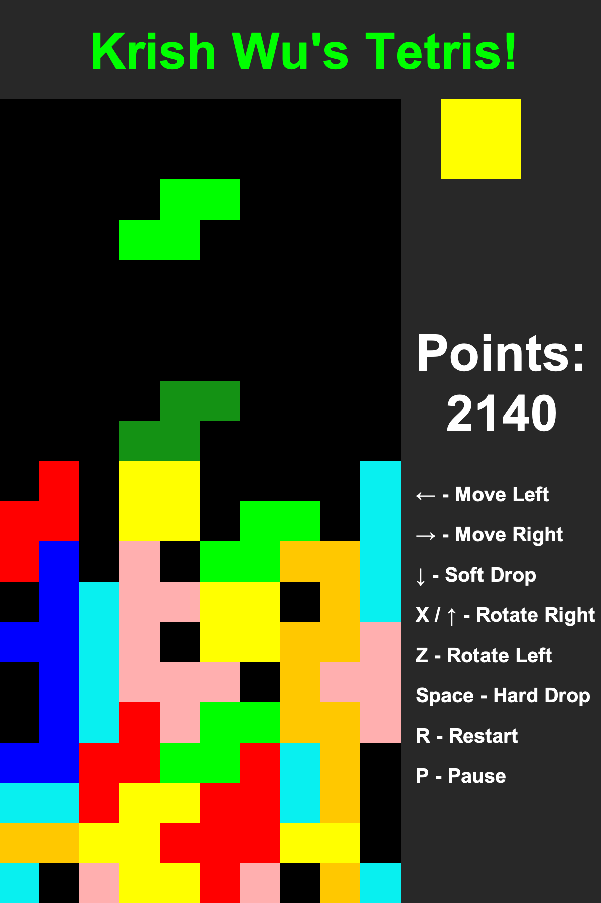

# Krish Wu's Tetris

A complete Tetris game written from scratch in Java with Swing. No game engine, no external
libraries, no build tool. Computer Science A final project.



## Features

- Full 20 x 10 playfield with all seven tetrominoes (I, J, L, O, S, T, Z)
- **Ghost piece** showing where the current piece will land
- Next-piece preview
- Hard drop, soft drop, and rotation in both directions
- Line clearing with classic scoring, and a difficulty curve that speeds the game up as you clear lines
- Pause and restart
- Background music and sound effects for hard drops and line clears

## Controls

| Key | Action |
| --- | --- |
| <kbd>←</kbd> / <kbd>→</kbd> | Move left / right |
| <kbd>↓</kbd> | Soft drop (hold to fall faster) |
| <kbd>↑</kbd> or <kbd>X</kbd> | Rotate clockwise |
| <kbd>Z</kbd> | Rotate counter-clockwise |
| <kbd>Space</kbd> | Hard drop |
| <kbd>P</kbd> | Pause / resume |
| <kbd>R</kbd> | Restart |

> The letter keys are lowercase-only, so Caps Lock will stop <kbd>R</kbd>, <kbd>Z</kbd>,
> <kbd>X</kbd> and <kbd>P</kbd> from responding.

## Requirements

Java 17 or newer. Check with `java -version`.

## Running the game

```bash
java -jar KrishWusTetris.jar
```

**Run it from the project folder.** The game loads its sound files from `./sound/`, relative to the
directory you launch it from, so starting it from anywhere else, including double-clicking the jar
in Finder, exits immediately with a `FileNotFoundException` instead of opening a window. If that
happens, `cd` into this folder first and try again.

## Building from source

```bash
javac -d build krishwu/*.java
```

Then run it with:

```bash
java -cp build krishwu.Main
```

To rebuild the distributable jar, the audio has to be copied into `build/` first, because the jar is
assembled from `build/sound/` rather than the top-level `sound/`:

```bash
cp -R sound build/ && jar cfm KrishWusTetris.jar MANIFEST.MF -C build krishwu -C build sound
```

`MANIFEST.MF` must end with a newline. Without it the `jar` tool silently drops the `Main-Class`
entry and the jar fails with "no main manifest attribute".

## Project layout

```
krishwu/            source
  Main.java           entry point, builds the window
  Canvas.java         all drawing, keyboard input, the game clock, and audio
  Game.java           the model: board, active piece, scoring, line clears
  GamePiece.java      one tetromino as a 2D array, plus rotation
  Sound.java          wrapper around javax.sound.sampled.Clip
sound/              music and sound effects (.wav)
build/              compiled classes, plus the copy of sound/ used to build the jar
docs/               screenshot for this README
MANIFEST.MF         jar manifest, sets Main-Class
KrishWusTetris.jar  the built game
```

## How it works

`Game` holds the board as an `int[20][10]`, where `0` is empty and `1`-`7` identify the seven piece
colors. The falling piece is never written into that array. It is kept separately as a `GamePiece`
plus an `(x, y)` origin, and composited on top when the board is drawn. The ghost is the same piece
drawn at the row a hard drop would reach, using color values `8`-`14` so `Canvas` can render it
translucent.

`Canvas` drives everything from a single `javax.swing.Timer`. Each tick advances a counter, and once
that counter crosses a threshold the piece falls one row. Holding <kbd>↓</kbd> lowers the threshold,
which is what makes the soft drop work.

Rotation is a plain transpose of the piece's own square bounding box. There are no wall kicks: if a
rotation would put the piece off the board or into a settled block, it simply doesn't happen.

## Scoring and speed

| Lines cleared at once | Points |
| --- | --- |
| 1 | 40 |
| 2 | 100 |
| 3 | 300 |
| 4 | 1200 |

The drop interval is scaled by `1 / (1 + 0.05 x total lines cleared)`, so the game is twice as fast
after 20 lines and keeps accelerating from there.

## Known issues

- **Closing the window doesn't quit the game.** The window disappears but the process and the music
  keep running; quit it from the terminal or Activity Monitor.
- The game runs slightly slower on a busy machine, because the drop speed counts timer ticks rather
  than actual elapsed time.
